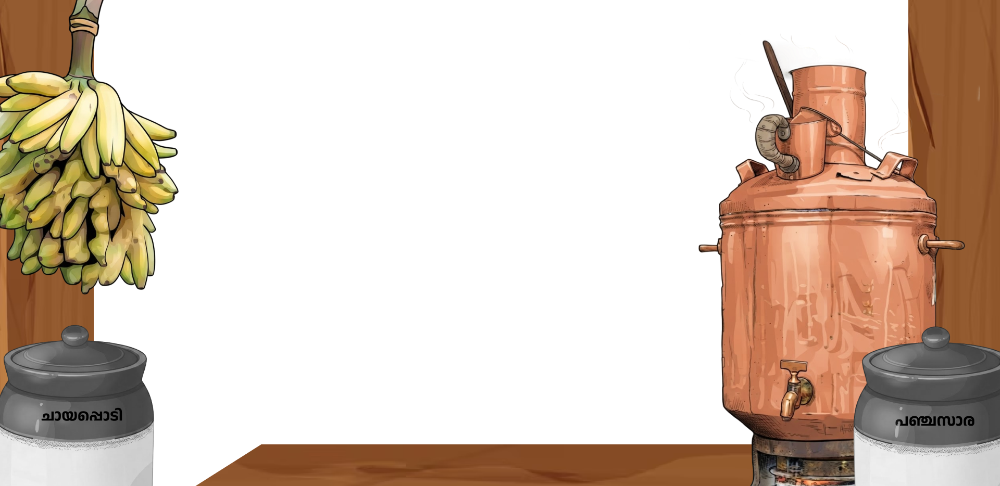
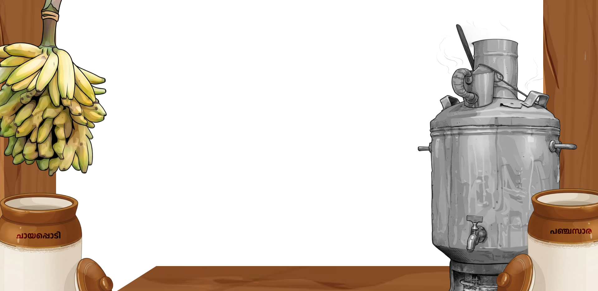
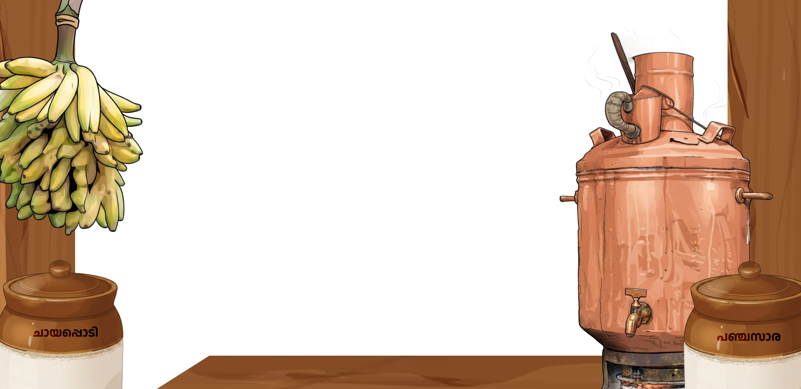

# SOMAN ORU CHAYA 🎯


## Basic Details
### Team Name: Grove Street


### Team Members
- Team Lead: Aravind R - NSSCE
- Member 2: Arjun M L - NSSCE

### Project Description
SOMAN ORU CHAYA is a browser-based tea-making game controlled by webcam hand gestures. Players move virtual tea objects, add ingredients, and perform Chaya Adi by pouring tea between two glasses.

The game uses MediaPipe Hand Landmarker to track up to two hands and evaluates the player's pouring performance through score, tea volume, spillage, and final ending videos.

### The Problem (that doesn't exist)
Soman Chettan needs one perfectly prepared and properly beaten cup of tea before he can start his day. Unfortunately, ordinary tea-making is not unnecessarily complicated enough.

### The Solution (that nobody asked for)
We turned tea preparation into a webcam-controlled computer-vision game. Players must move the virtual boiler, add sugar and tea powder, then tilt two tracked glasses and pour the tea accurately before the timer runs out.

## Technical Details
### Technologies/Components Used
For Software:
- JavaScript
- React 19
- Vite
- Tailwind CSS
- MediaPipe Tasks Vision and Hand Landmarker
- HTML video and canvas APIs
- ESLint

For Hardware:
- A computer with a modern web browser
- Webcam with microphone not required
- Optional GPU acceleration through the browser
- Stable internet connection for the MediaPipe WASM runtime and hand-landmarker model

### Implementation
For Software:
# Installation
```bash
npm install
```

# Run
```bash
npm run dev
```

The game requests webcam permission in the browser. `npm run build` creates the production build and `npm run preview` serves that build locally.

### Project Documentation
For Software:

# Screenshots (Add at least 3)

*Opening gameplay frame showing the first tea-making interaction.*


*Ingredient stage frame used while adding sugar and tea powder.*


*Chaya Adi frame used for the two-hand tea-pouring stage.*

# Diagrams

*Project overview image for the webcam-controlled tea-making experience.*

For Hardware:

# Schematic & Circuit

*No electronic circuit is used; the webcam is accessed through the browser's getUserMedia API.*


*Hardware setup consists of a computer, browser, and webcam.*

# Build Photos

*The project uses a computer and webcam rather than a separate electronics kit.*


*The software was assembled as a Vite React application with MediaPipe hand tracking.*


*Final project presentation image.*

### Project Demo
# Video
[Demo video link is not published in this repository]
*A demo video should show webcam permission, one-hand object control, ingredient interaction, two-hand Chaya Adi pouring, the visible timer, and the final result.*

# Additional Demos
The local development server is available through `npm run dev`. No public demo URL is currently included in the repository.

## Team Contributions
- Arjun M L: React and Vite development, MediaPipe hand tracking, gesture interaction, game logic, pouring simulation, score and timer systems
- Aravind R: 2D and 3D visual assets, game concept, ideation, documentation, and project presentation

---
Made with ❤️ at TinkerHub Useless Projects 


